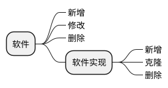
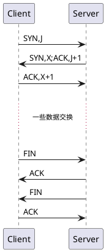
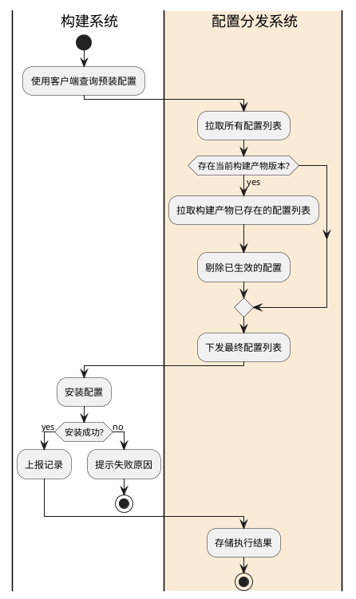
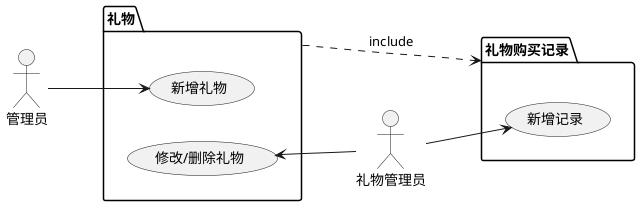
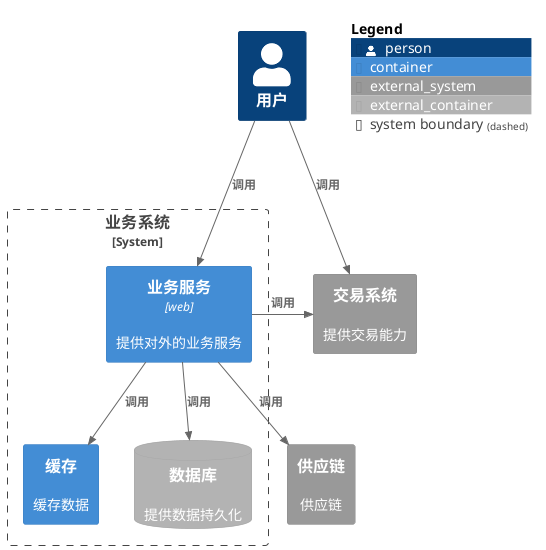
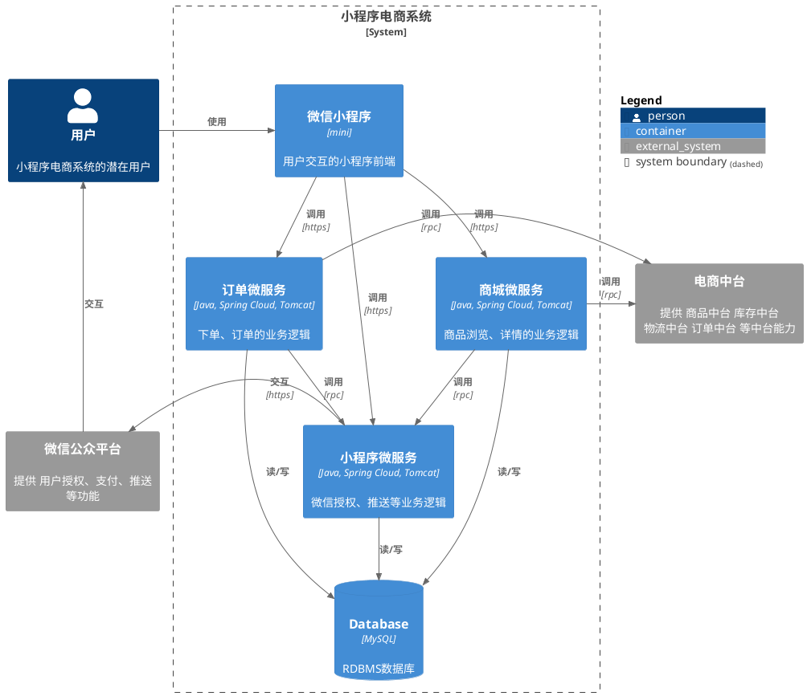

在工作编写文档的时候，我们不可避免地需要画各种图来更好的解释文档，帮助读者理解意图。
常见的图有思维导图、活动图(流程图)、时序图、用例图等等。

描述业务流程，一般使用流程图（即活动图）和时序图来表示，参考 https://plantuml.com/zh/；  
模块关系、服务关系等架构图推荐使用 c4 模型，参考 https://c4model.com/。  
可应对大多数场景

## 常见图示例
### 思维导图

@startuml
@startmindmap
* 软件
  **_ 新增
  **_ 修改
  **_ 删除
  ** 软件实现
    ***_ 新增
    ***_ 克隆
    ***_ 删除
@endmindmap 
@enduml
### 时序图

@startuml
Client -> Server: SYN,J
Server -> Client: SYN,X;ACK,J+1
Client -> Server: ACK,X+1
|||
... 一些数据交换 ...
|||
Client -> Server: FIN
Server -> Client: ACK
Server -> Client: FIN
Client -> Server: ACK
@enduml
### 活动图

@startuml
|h| 构建系统
start
:使用客户端查询预装配置;
|#AntiqueWhite|r| 配置分发系统
:拉取所有配置列表;
if (存在当前构建产物版本?) then (yes)
:拉取构建产物已存在的配置列表;
:剔除已生效的配置;
endif
:下发最终配置列表;

|h|
:安装配置;
if (安装成功?) then (yes)
:上报记录;
else (no)
:提示失败原因;
stop
endif
|r|
:存储执行结果;
stop
@enduml

### 用例图

@startuml
left to right direction

actor "管理员" as admin
actor "礼物管理员" as g_admin

package 礼物 as gift {
usecase "新增礼物" as add_gift
usecase "修改/删除礼物" as update_delete_gift
}

package 礼物购买记录 as gift_revision {
usecase "新增记录" as add_gift_revision
}

admin --> add_gift
update_delete_gift <-- g_admin
g_admin --> add_gift_revision

gift ..> gift_revision : include

@enduml
## C4模型

@startuml
!include <C4/C4_Context>
!include <C4/C4_Container>
Person(user, "用户")
System_Boundary(c1, "业务系统") {
  Container(web,"业务服务","web","提供对外的业务服务")
  Container(redis,"缓存",,"缓存数据")
  ContainerDb_Ext(mysql,"数据库",,"提供数据持久化")
}
System_Ext(exchange, "交易系统", "提供交易能力")
System_Ext(supplyChain, "供应链", "供应链")

Rel(web, redis, "调用")
Rel(web, mysql, "调用")
Rel(user, exchange, "调用")
Rel(user, web, "调用")
Rel_R(web, exchange, "调用")
Rel(web, supplyChain, "调用")

SHOW_FLOATING_LEGEND()
@enduml

@startuml
!include <C4/C4_Context>
!include <C4/C4_Container>
Person(user, "用户", "小程序电商系统的潜在用户")
System_Boundary(c1, "小程序电商系统") {
  Container(miniApp, "微信小程序", "mini", "用户交互的小程序前端", $sprite="weixin")
  Container(mallService, "商城微服务", "Java, Spring Cloud, Tomcat", "商品浏览、详情的业务逻辑", $sprite="java")
  Container(orderService, "订单微服务", "Java, Spring Cloud, Tomcat", "下单、订单的业务逻辑", $sprite="java")
  Container(miniService, "小程序微服务", "Java, Spring Cloud, Tomcat", "微信授权、推送等业务逻辑", $sprite="java")
  ContainerDb(database, "Database", "MySQL", "RDBMS数据库", $sprite="mysql")
}
System_Ext(ecomMiddlePlatform, "电商中台", "提供 商品中台 库存中台 物流中台 订单中台 等中台能力")
System_Ext(weixinPlatform, "微信公众平台", "提供 用户授权、支付、推送 等功能")
Rel_R(user, miniApp, "使用")
Rel(miniApp, mallService, "调用", "https")
Rel(miniApp, orderService, "调用", "https")
Rel(miniApp, miniService, "调用", "https")
Rel(orderService, miniService, "调用", "rpc")
Rel(mallService, miniService, "调用", "rpc")
Rel_L(miniService, weixinPlatform, "交互", "https")
Rel_U(weixinPlatform, user, "交互")
Rel_R(orderService, ecomMiddlePlatform, "调用", "rpc")
Rel_R(mallService, ecomMiddlePlatform, "调用", "rpc")
Rel(mallService, database, "读/写")
Rel(orderService, database, "读/写")
Rel(miniService, database, "读/写")
SHOW_FLOATING_LEGEND()
@enduml

## 参考
* https://cloud.tencent.com/developer/article/1876902
* https://blog.csdn.net/zhetmdoubeizhanyong/article/details/109501697